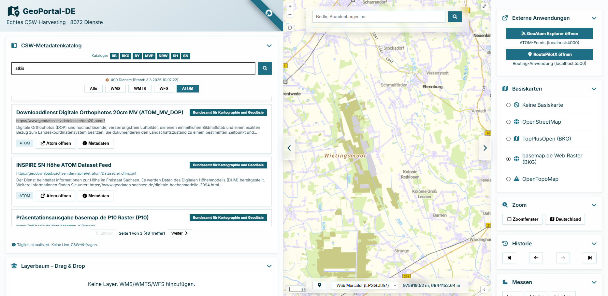

# GeoPortal‑DE

---

## Deutschlands Geodaten. Zentral. Professionell. Sofort nutzbar.

**GeoPortal‑DE** ist Ihr professioneller Zugang zur gesamten öffentlichen Geodatenlandschaft Deutschlands – gebündelt, strukturiert und sofort einsatzbereit.

Statt komplexer Einzelintegrationen, instabiler Live‑Schnittstellen oder zeitaufwändiger Dienstrecherchen erhalten Sie:

* täglich aktualisierte Metadaten aus Bund und allen 16 Bundesländern
* einen leistungsstarken, browserbasierten Kartenclient
* eine unternehmensgerechte Infrastruktur mit Proxy, Verfügbarkeitsprüfung und Exportfunktionen

Ob Behörde, Planungsbüro, Ingenieurdienstleister oder Versorgungsunternehmen – mit GeoPortal‑DE greifen Sie **schnell, rechtssicher und strukturiert** auf amtliche Geodaten zu.

---

# 🖥️ Showcase – Praxisbeispiele aus dem Portal

## 1️⃣ Gesamtüberblick & Layerstruktur

Zentrale Kartenansicht mit Basiskartenwahl, Layerbaum, Gruppenbildung und transparenter Steuerung aller eingebundenen Dienste.

## 2️⃣ WMS‑Integration (BORIS Beispiel)

Einbindung eines WMS‑Dienstes inklusive Legendenabfrage, Layersteuerung und Projektion.

## 3️⃣ WFS‑Feature‑Abfrage (BORIS WFS)

Direkte Feature‑Identifikation und Attributanzeige aus einem WFS‑Dienst – performant im sichtbaren Kartenausschnitt geladen.

## 4️⃣ WMTS‑Dienst mit TileMatrixSet‑Erkennung

Automatische Auswahl des passenden TileMatrixSets je Projektion – stabil und hochperformant.

## 5️⃣ ATOM‑Feed & Datenzugriff

Integrierter GeoAtom Explorer zur strukturierten Darstellung von ATOM‑Datenquellen.

## 6️⃣ Projektkonfiguration importieren

Import und Wiederherstellung kompletter Layer‑Setups inklusive Kartenausschnitt und Projektion – ideal für wiederkehrende Projekte.

---

# 🚀 Highlights

* **Umfassende Datenbasis** – Tägliches Harvesting aller relevanten CSW‑Kataloge der GDI‑DE (WMS, WMTS, WFS, ATOM)
* **Keine Live‑Abhängigkeit** – Metadaten werden strukturiert vorgehalten, Karten bei Bedarf geladen
* **Professioneller Kartenclient** – OpenLayers‑basiert, performant und stabil
* **Layerverwaltung auf Enterprise‑Niveau** – Drag & Drop, Gruppen, Transparenz, Metadaten, Identifikation
* **Integrierter PDF‑Export** – Druckfertige Karten für Gutachten und Anlagen
* **Proxy‑Architektur** – Keine CORS‑Probleme, stabile Dienstabfragen
* **Verfügbarkeitsprüfung** – Ampelsystem für alle eingebundenen Dienste

---

# 🗺️ Funktionsübersicht

## 📚 CSW‑Metadatenkatalog

* Volltextsuche über Titel, Abstract und Schlagwörter
* Filter nach Diensttyp (WMS, WMTS, WFS, ATOM)
* Detailansicht mit Kontakt, Gebühren, Ausdehnung und Layerliste
* Mehrere Layer eines Dienstes werden automatisch gruppiert
* ATOM‑Feeds öffnen sich im integrierten GeoAtom Explorer

## 🧭 Layerbaum & Layerverwaltung

* Übersichtliche Drag‑Drop‑Struktur
* Automatische Gruppenbildung pro Dienst
* Sichtbarkeit & Transparenz je Layer
* WMS‑Legendenanzeige
* WFS‑Feature‑Identifikation
* Export als GeoJSON
* JSON‑Export/Import kompletter Projektkonfigurationen

## 🌐 Manuelle Dienstintegration

* WMS, WMTS, WFS per URL
* Automatische Capabilities‑Analyse mit Versions‑Fallback
* WMTS TileMatrixSet‑Erkennung
* WFS‑Ladevorgang im sichtbaren Kartenausschnitt (bis 10.000 Features)
* Proxy‑gestützte, CORS‑freie Abfragen

## 🖼️ Kartenfunktionen

* Basiskarten: OSM, TopPlusOpen, basemap.de, OpenTopoMap
* Projektionen: EPSG:3857, 4326, 25832, 25833, 31467
* Mauskoordinaten im gewählten CRS
* Geolokalisierung
* Drag‑Zoom & Deutschland‑Zoom
* Navigationshistorie

## 📏 Messen & PDF‑Export

* Dynamische Längen‑ und Flächenmessung
* PDF‑Export mit Format (A0–A5), DPI (72–300), PNG/JPEG
* Optionaler Titel, Gitternetz, EPSG‑Code, Layerliste, Datum
* Druckoptimiert für Gutachten und Behördenunterlagen

## 🔍 Adresssuche

* Nominatim‑basierte Suche über Proxy
* Ergebnisliste mit Zoomfunktion

## 🐞 Debug‑Panel

* Konsolidierte Browser‑Fehlermeldungen
* Ein‑/ausblendbar
* Ideal bei komplexen Dienstlandschaften

---

# 🔧 Technische Basis

| Komponente       | Technologie                      |
| ---------------- | -------------------------------- |
| Frontend         | HTML5, CSS3, JavaScript (ES6)    |
| Kartenbibliothek | OpenLayers v10.8                 |
| Proxy            | Node.js                          |
| Harvesting       | Täglicher CSW‑Abruf → JSON‑Cache |
| Styling          | Eigenes responsives CSS          |
| Deployment       | Kein Build‑Schritt erforderlich  |

---

# 🏢 Für professionelle Nutzung konzipiert

* Strukturierte, wiederkehrende Projektarbeit
* Mandantenfähige Einsatzszenarien
* On‑Premise‑Option für Behörden & KRITIS
* Wartung & Updates inklusive
* Erweiterbar um zusätzliche Datenquellen

---

# 📦 Abonnement & Lizenzmodell

GeoPortal‑DE ist bewusst als **transparentes Subscription‑Modell** konzipiert – ohne versteckte Kosten, ohne komplexe Lizenzstrukturen.

## 🔹 Basic – 49 € / Monat

Ideal für Einzelanwender und kleinere Projekte

* Zugriff auf das öffentliche Portal
* Bis zu 2 gleichzeitige Instanzen
* Standard‑PDF‑Export
* E‑Mail‑Support

## 🔹 Professional – 199 € / Monat

Für Teams und mittelständische Unternehmen

* Unbegrenzte Layeranzahl
* Erweiterter PDF‑Export
* JSON‑Projekt‑Export/Import
* Prioritäts‑Support
* Erweiterte Debug‑ und Prüfmechanismen

## 🔹 Enterprise – Individuelles Angebot

Für Behörden, Großunternehmen und Infrastrukturbetreiber

* On‑Premise‑Installation
* Individuelle Anpassungen
* SLA & definierte Reaktionszeiten
* Integration zusätzlicher Datenquellen
* Dedizierter Ansprechpartner

**Testzugang:** 14 Tage kostenfrei und unverbindlich.

---

# 🚀 Schnellstart

Testlizenz per E‑Mail anfordern.

---

# 🛠️ Enterprise Self‑Hosting

Enthalten im Installationspaket:

* Node.js‑Harvester + Proxy
* Frontend‑Code (HTML/CSS/JS)
* Konfigurationsleitfaden
* Unterstützung bei der Einrichtung

---

# 📞 Kontakt

**wm87 GbR**
Musterstraße 123
12345 Musterstadt
Deutschland

E‑Mail: [info@geoportal-de.example](mailto:info@geoportal-de.example)
Telefon: +49 123 4567890
Handelsregister: HRB 98765
USt‑ID: DE987654321

---

# 📄 Rechtliches

Die bereitgestellten Geodaten unterliegen den Lizenzbedingungen der jeweiligen Datenquellen (Bund, Länder, BKG, OpenStreetMap u.a.).
Für Inhalte externer Dienste wird keine Haftung übernommen.
Design und Software sind Eigentum der wm87 GbR.

---

# GeoPortal‑DE

**Die zentrale Plattform für die professionelle Nutzung öffentlicher Geodaten in Deutschland.**
